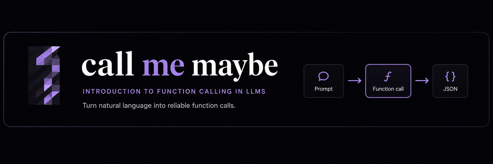

*This project has been created as part of the 42 curriculum by vslyunko.*

<p align="center">
  
</p>

<p align="center">
  
  
  
  
  
</p>

<p align="center">
Natural language → reliable function calls
</p>

## DESCRIPTION

**Call Me Maybe** is a function-calling system powered by a small language model.

Instead of relying on the LLM to freely generate structured output, the program constrains the generation process **token by token** so that every result follows valid JSON syntax and the expected function schema.

Given a prompt such as:

```text
What is the sum of 2 and 3?
```

the program produces a structured function call:

```json
{
    "prompt": "What is the sum of 2 and 3?",
    "name": "fn_add_numbers",
    "parameters": {
        "a": 2,
        "b": 3
    }
}
```

The LLM decides **which function to call and which values to use**, while a custom finite-state decoder controls which tokens are valid at every generation step.

---
## INSTRUCTIONS

### Installation

Install the project dependencies with:

```bash
make install
```

### Running the program

Run with the default input files:

```bash
make run
```

or directly with:

```bash
uv run python -m src
```

### Custom input files

```bash
uv run python -m src \
    --functions_definition path/to/functions.json \
    --input path/to/prompts.json \
    --output path/to/results.json
```

| Argument | Default |
| --- | --- |
| `--functions_definition` | `data/input/functions_definition.json` |
| `--input` | `data/input/function_calling_tests.json` |
| `--output` | `data/output/function_calling_results.json` |
| `--visualize` | `False` |

### Other commands

```bash
make debug        # Run with Python's debugger
make clean        # Remove Python and tool caches
make lint         # Run flake8 and mypy
make test         # Run test
```

---

## HOW IT WORKS

Call Me Maybe uses a custom **finite-state decoder** to constrain the LLM output during generation.

For each token:
1. The LLM produces logits for the possible next tokens.
2. The decoder checks its current state.
3. It determines which tokens would keep the JSON valid and schema-compliant.
4. Invalid logits are masked.
5. The highest-scoring valid token is selected.
6. The decoder advances to the next state.
7. The process repeats until the JSON object is complete.

```text
Prompt
  ↓
LLM logits
  ↓
Decoder state
  ↓
Allowed tokens
  ↓
Mask invalid logits
  ↓
Select next token
  ↓
Repeat until DONE
```

The decoder does not replace the LLM: the model still chooses between valid possibilities. The decoder only prevents outputs that would break the required structure.

### Design choices

- **Finite-state machine** — makes every generation stage explicit and predictable.
- **Greedy decoding** — keeps generation deterministic.
- **Token caching** — avoids repeated tokenization of identical strings.
- **Skip logits when only one token is valid** — reduces unnecessary LLM computations.
- **NumPy masking** — efficiently filters invalid token logits.
- **Pydantic validation** — validates input structures and generated results.

The decoder supports `string`, `integer`, `number` and `boolean` parameters according to each function definition.

### Performance & reliability

Constrained decoding guarantees **structurally valid, schema-compliant JSON**.

Function selection and argument extraction still depend on the LLM, while the decoder guarantees that the final structure can be parsed correctly.

Performance is improved by caching tokenization, skipping unnecessary model calls and using NumPy for logit masking.

---

## CHALLENGES

The main challenges were:

- understanding token-level generation, logits and vocabulary IDs;
- detecting when generated strings were complete while correctly handling escaped characters;
- adapting some initial C-style solutions into a more Pythonic structure.

These problems were approached by breaking the decoder into explicit states, testing transitions independently and progressively simplifying the implementation.

---

## TESTING

The implementation was validated using `pytest` and manual tests covering:

- malformed JSON files;
- missing input files;
- invalid function schemas;
- string, integer, number and boolean parameters;
- edge cases in generated strings;
- final output validation with Pydantic.

Generated results are validated before being written to the output file.

---

## EXAMPLE

Given the function definition:

```json
{
    "name": "fn_greet",
    "description": "Generate a greeting message for a person by name.",
    "parameters": {
        "name": {
            "type": "string"
        }
    }
}
```

and the prompt:

```text
Greet John
```

Call Me Maybe generates:

```json
{
    "prompt": "Greet John",
    "name": "fn_greet",
    "parameters": {
        "name": "John"
    }
}
```

The LLM identifies the appropriate function and parameter value, while the decoder ensures that the generated structure follows the function schema.

---

## RESOURCES

The following resources were consulted during the development of the project:

### LLMs & constrained decoding

- [Controlling your LLM: Deep Dive into Constrained Generation](https://medium.com/@docherty/controlling-your-llm-deep-dive-into-constrained-generation-1e561c736a20)
- [LLM Breakdown: Logits and Next-Token Prediction](https://mikexcohen.substack.com/p/llm-breakdown-26-logits-and-next)
- [Constrained Decoding: Grammar-Guided Generation for Structured Output](https://mbrenndoerfer.com/writing/constrained-decoding-structured-llm-output)
- [Function Calling Internals: Grammars and Constrained Decoding](https://www.salmanq.com/blog/llm-constrained-sampling/)

### Python

- [pytest tutorial](https://www.youtube.com/watch?v=mzlH8lp4ISA)
- [argparse tutorial](https://www.youtube.com/watch?v=88pl8TuuKz0)
- [JSON module](https://www.youtube.com/watch?v=4rmBOxn0PdI)

Additional documentation was consulted for **Pydantic, error handling, list comprehensions and uv**.

### AI usage

AI was used as a learning and development support tool, mainly to:

- understand unfamiliar LLM concepts such as logits, tokenization and constrained decoding;
- discuss implementation approaches when blocked;
- improve naming and code structure;
- identify repeated logic;
- explore more Pythonic alternatives to some initial C-style solutions;
- improve project documentation.

All suggestions were reviewed, understood and adapted manually before being incorporated into the project.